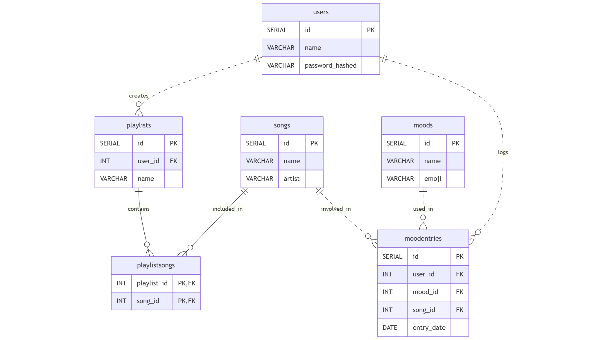

# Design Document

## Scope

Users can log there daily mood and song they listen which can then be used for creating playlists and recommendations from similar users.

Included in the scope:

- Users: individuals who interact with the system, log moods, and create playlists.

- Songs: tracks that users associate with moods or add to playlists.

- Moods: emotional states (like "happy", "sad") that users can log, optionally with emojis.

- Mood Entries: records that link a user, a song, and a mood on a specific date.

- Playlists: collections of songs created by a user.

- Relationships between users, songs, moods, and playlists.
    
Not Included in the scope:

- Song metadata: genre,duration,etc

- Geographic data or user locations.

## Functional Requirements

A user should be able to:

- Register (have a unique username and password).

- Log moods and associate each mood with a specific song and date.

- Create playlists with custom names.

- Add songs to playlists they own.

- View their past mood entries, associated songs, and playlists.

- Retrieve songs by playlist or see what mood they were in when listening to certain songs.

- Delete their account, which will also remove their playlists and mood entries (via ON DELETE CASCADE).

Users should not be able to:

- View or modify others data (e.g., playlists, moods).

- Stream or play songs.

- Integrate with third-party music services.

- Perform social interactions, such as liking, commenting, or following other users.

## Representation

### Entities

The main entities are:

- Users – people who log moods and manage playlists.

- Songs – individual songs that can be linked to moods or added to playlists.

- Moods – emotional states (like “happy” or “sad”) optionally paired with emojis.

- Mood Entries – records connecting users, moods, songs, and the date they felt that way.

- Playlists – user-created collections of songs.

- PlaylistSongs – join table representing songs assigned to specific playlists.

| Entity            | Attributes                                          |
| ----------------- | --------------------------------------------------- |
| **Users**         | `id`, `name`, `password_hashed`                     |
| **Songs**         | `id`, `name`, `artist`                              |
| **Moods**         | `id`, `name`, `emoji`                               |
| **MoodEntries**   | `id`, `user_id`, `song_id`, `mood_id`, `entry_date` |
| **Playlists**     | `id`, `user_id`, `name`                             |
| **PlaylistSongs** | `playlist_id`, `song_id` (composite key)            |

#### Types

- SERIAL for id columns — simple auto-incrementing integer IDs for primary keys.

- VARCHAR(n) for names,artist,passwords,etc — can be used to represent almost all name values while placing reasonable length limits.

- INT for foreign keys — efficient, compact, and maps directly to SERIAL primary keys.

- DATE for mood entries — represents the calendar date when the mood was entered.

#### Constraints

- NOT NULL — ensures essential fields (like name, password, etc.) are always filled out.

- UNIQUE — prevents duplicate usernames or mood names.

- PRIMARY KEY — uniquely identifies each record and supports indexing.

- FOREIGN KEY — enforces valid relationships between users, songs, moods, etc., ensuring data integrity.

- ON DELETE CASCADE — makes sure that when a user or playlist is deleted, all their related entries are automatically removed — avoids orphaned records.

### Relationships

#### Entity Relationships
| Entity A          | Entity B      | Relationship Type |
| ----------------- | ------------- | ----------------- |
| Users             | Playlists     | One-to-Many       |
| Users             | MoodEntries   | One-to-Many       | 
| Songs             | MoodEntries   | One-to-Many       |
| Moods             | MoodEntries   | One-to-Many       | 
| Playlists         | PlaylistSongs | One-to-Many       |
| Songs             | PlaylistSongs | One-to-Many       |

## Optimizations

- Indexes : Created multiple indexes like 
    - `username` ON users(name)
    - `moodname` ON moods(name), etc

  for faster lookup using name and 
    - `moodentries_user_id` ON moodentries(user_id),
    - `playlists_user_id` ON playlists(user_id), etc

  for performance when using foreign keys
- Views : Created a view `song_mood` for viewing user, song, and mood of the song simplifying complex query. Users can access pre-joined information without writing multi-join queries every time.

- Function : Implemented a `getusersongs` function that provides a parameterized query to fetch user-specific data.

## Limitations

| Limitation Area          | What's Missing or Weak                      |
| ------------------------ | ------------------------------------------- |
| Playlist ownership       | No multi-user/shared playlists              |
| Mood detail              | No duration, time of day, or mood intensity |
| Song metadata            | Missing genre, album, duration              |
| Timestamps               | No time of day or timezone in moodentries   |

